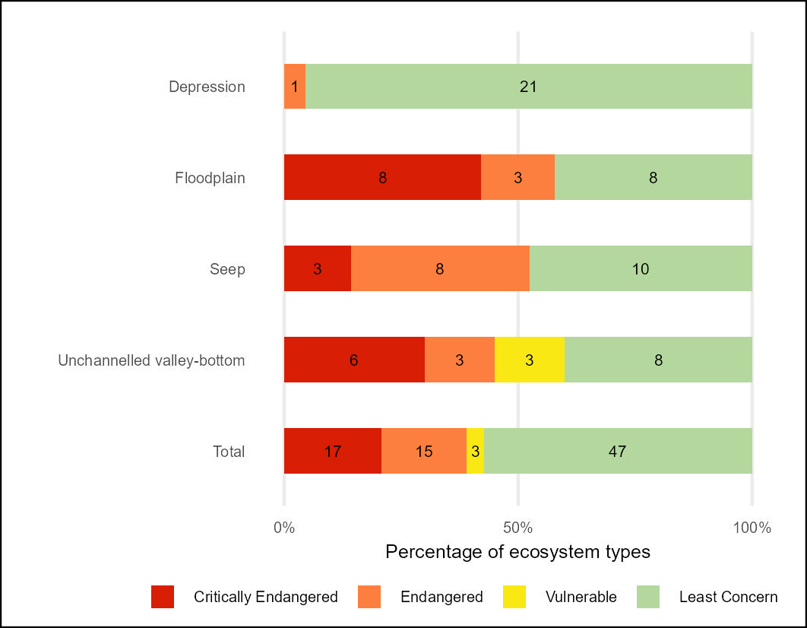

## **Workflows for undertaking the (inland) Wetland Red List of Ecosystems (RLE) assessment**

### **National Biodiversity Assessment - South Africa**

*South African National Biodiversity Institute (SANBI)*

June 2025

#### **Summary**

This repository contains a workflow that results in the NBA 2025 Red List of Ecosystems indicators for (inland) Wetland Ecosystems of South Africa following the methods of [van Deventer et al., 2019](http://hdl.handle.net/20.500.12143/5847)

The Quarto document [RLE_wet.qmd](RLE_wet.qmd) describes the import of the South African wetland database (version x ) prepared by SANBI. The data were imported using the sf package in R and summarised using the tidyverse.

The Red List of Ecosystems (known as Ecosystem Threat Status in South Africa) assesses the risk of collapse of each ecosystem type based on a range of criteria on extent, condition and pressures faced by each ecosystem type. For consistency with past NBAs this assessment follows the methods developed by Nel et al., 2011 and modified by [van Deventer et al., 2019](http://hdl.handle.net/20.500.12143/5847). Each of the 100 wetland ecosystem types were assigned to one of the four risk categories: Critically Endangered, Endangered, Vulnerable and Least Concern.

The analysis approach of van Deventer et al., 2019 uses the proportion of each ecosystem type that is in a good - fair condition (Wet Health class A, B and C) and a set of thresholds. If less than 20% of a type (measured by extent) is in an A or B condition then the type is categorised as Critically Endangered; if between 20-35% of the type is in A or B condition then the type is categorised as Endangered; if less than 60% of the type is in A or B or C condition then the type is categorised as Vulnerable; if none of these thresholds are crossed then the type is Least Concern.

The IUCN RLE approach was also followed and Criterion D3 was applied to the Present Ecological State (PES) data such that Severity \>=90% was assigned to classes E-F; Severity \>=70% was assigned to classes D-F; Severity \>=50% was assigned to class C-F. Criterion B1i was applied using EOO calculations and ongoing decline was defined as PES D-F \>= 70% extent.

#### **Results:**

Overall per-ecosystem type Threat Status 2024 results for wetland using South African methods (Van Deventer et.al., 2019) and IUCN RLE methods [rle_wet_metrics_per_type.csv](outputs/rle_wet_metrics_per_type.csv)

Summary table - count of wetland ecosystem types per HGM zone per South African ETS category [rle24sa_wet_count.csv](outputs/rle24sa_wet_count.csv)

Summary table - count of wetland ecosystem types per HGM zone per IUCN RLE category [rle24_wet_count.csv](outputs/rle24_wet_count.csv)

| RLE 2024 - Wetlands | ETS 2024 - Wetlands |
|----|----|
|  |  |
