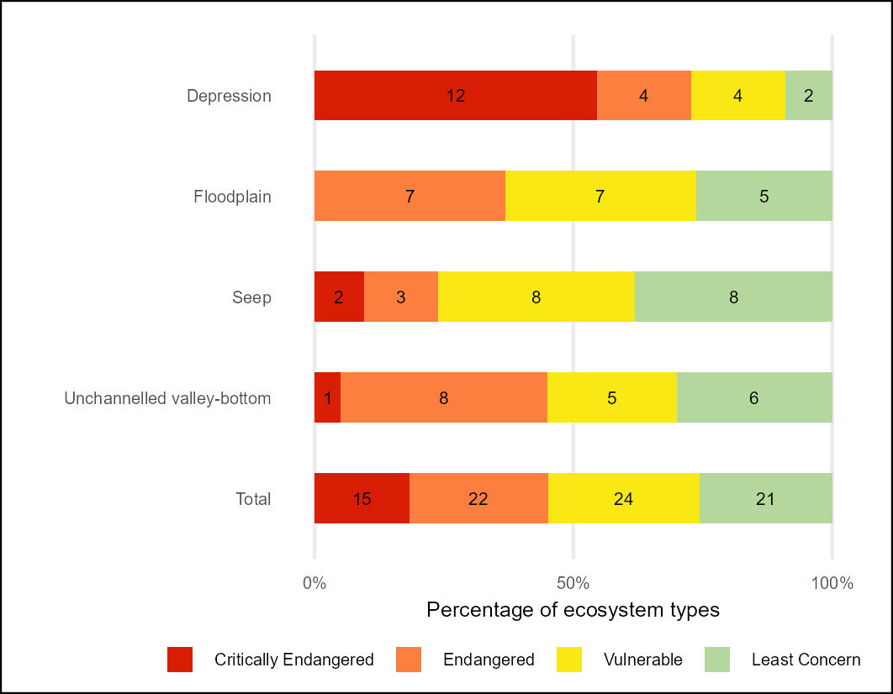
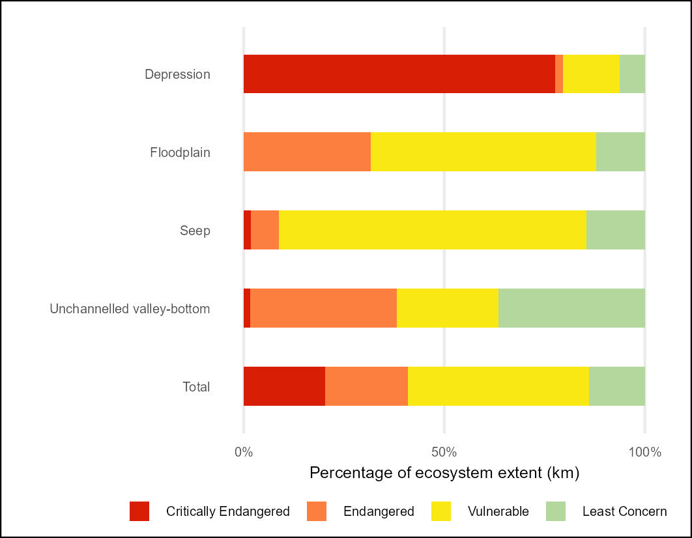
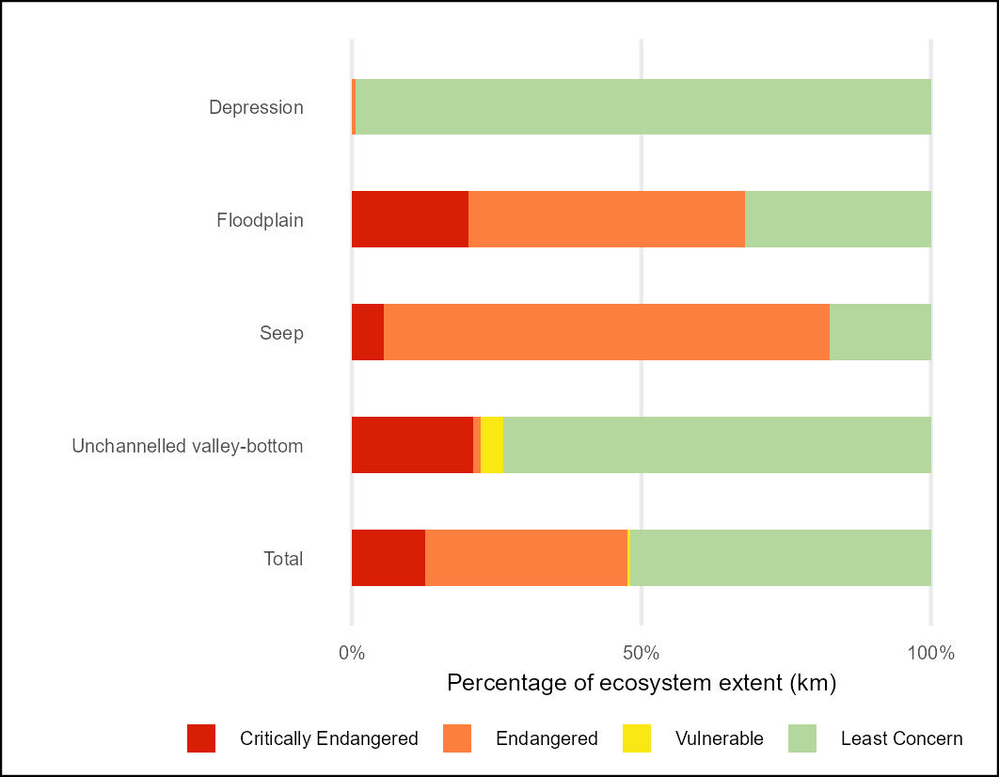
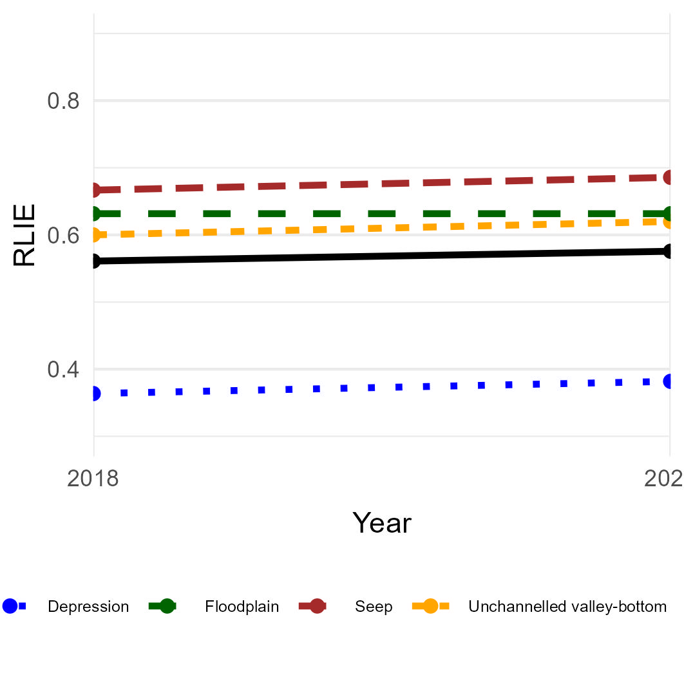

## **Workflows for undertaking the (inland) Wetland Red List of Ecosystems (RLE) assessment**

### **National Biodiversity Assessment - South Africa**

*South African National Biodiversity Institute (SANBI)*

August 2025

#### **Summary**

This repository contains a workflow that results in the NBA 2025 Red List of Ecosystems indicators for (inland) wetland ecosystems of South Africa. The Quarto document [RLE_wet.qmd](RLE_wet.qmd) describes the import of the South African wetland database (version 20250811 ) prepared by SANBI. The data set covers 81 inland wetland ecosystem types in South Africa and includes per-feature ecosystem condition data in six categories (A-F) and Present Ecological State (PES) scores developed using an implementation of the WET-Health 2.0 framework ([Macfarlane et. al., 2020](https://frcsa.org.za/wp-content/uploads/2020/10/TT-820_Final-web.pdf)) by Nacelle Collins (Collins et al., in prep).

-   Category A is natural, condition score \>= 90%

-   B is near natural, condition score \< 90% & \>= 80%

-   C is moderately modified, condition score \<80% & \>= 60%

-   D is heavily modified, condition score \< 60% & \>= 40%

-   E severely modified, condition score \< 40% & \>=20%

-   F is critically modified, condition score \< 20%

The Red List of Ecosystems (also known as Ecosystem Threat Status in South Africa) assesses the risk of collapse of each ecosystem type based on a range of criteria on extent, condition and pressures faced by each ecosystem type.

The IUCN RLE (v2) framework was applied and following criterion were assessed:

-   Criterion A2b (ecosystem extent decline over a 50 year period past and future) - current rate of decline in ecosystem extent based on land cover change rates between 1990 and 2022 - projected forward to 2040.

-   Criterion A3 (historical decline in ecosystem extent), based on land cover 2022, compared to historical potential extent.

-   Criterion B1ai was applied using EOO calculations with ongoing decline defined as habitat loss RoD (Rate of Decline) of \>= 0.4% per year calculated from land cover change data

-   Criterion B1aii was applied using EOO calculations with ongoing decline defined as a decline in the extent of good/moderate condition estuarine extent (PES Classes A, B, C) from the previous PES assessment period (2018 - 2024).

-   Criterion D2b was applied using the rate of change in condition between 2018 and 2024, projected forward to 2068 (a 50 year period).

-   Criterion D3 was applied to the Wetland Ecological State Class (PES) data such that: Severity of biotic disruption of \>= 90% was assumed for PES classes E-F; Severity \>=70% was assigned to PES classes D-F; Severity \>=50% was assigned to PES classes C-F. D3 was applied to each element of PES; Vegetation, Water Quality, Geomorphology, Hydrology, and the overall Wet Health score that combines these elements.

Each of the 81 wetland ecosystem types were assigned to one of the four risk categories: Critically Endangered, Endangered, Vulnerable and Least Concern. The highest risk category for these two criteria is selected as the threat / risk status for each river type.

For consistency with past assessments the South African Ecosystem Threat Status framework (developed by [Nel et al., 2010](DOI:%2010.1111/j.1472-4642.2006.00308.x) and modified by [van Deventer et al., 2019](http://hdl.handle.net/20.500.12143/5847)) was applied in a separate assessment. This approach uses the proportion of each ecosystem type that is in a good - fair condition (PES class A B and C) and a set of thresholds. If less than 20% of a type (measured by length of river segment) is in a A or B condition then the type is categorised as Critically Endangered; if between 20-35% of the type is in A or B condition then the type is categorised as Endangered; If less than 60% of the type is in A or or C condition then the type is categorised as Vulnerable; if none of these thresholds are crossed then the type is Least Concern. The results are referred to as ETS (Ecosystem Threat Status) to differentiate them from RLE results.

#### **Results:**

The assessment results per inland wetland ecosystem type for both the IUCN RLE and South African ETS are presented here [rle_wet_metrics_per_type.csv](outputs/rle_wet_metrics_per_type.csv)

Summary table - count of wetland ecosystem types per HGM zone per IUCN RLE category [rle24_wet_count.csv](outputs/rle24_wet_count.csv)

Summary table - count of wetland ecosystem types per HGM zone per South African ETS category [rle24sa_wet_count.csv](outputs/rle24sa_wet_count.csv)

| RLE 2024 - count of types | RLE 2024 - extent of types |
|----|----|
|  |  |
| South African ETS 2024 (count) | South African ETS 2024 (extent) |
|  |  |

**RLE Index**

Reflecting changes in RLE between 2018 and 2024 - This shows PES scores increased between 2018 and 2024

| RLIe based on IUCN RLE framework | RLIe based on South African ETS framework |
|----|----|
|  |  |

**Combined RLE and EPL results**

The Quarto document [RLE_EPL_results.qmd](RLE_EPL_results.qmd) describes the combination of the RLE and EPL results

IUCN RLE v2 and EPL results:

Full results per type : [outputs/wet_results_type.csv](outputs/wet_results_type.csv)

Simplified results for integration : [outputs/wet_results_for_integration.csv](outputs/wet_results_for_integration.csv)

Highly threatened and under protected : [outputs/riv_unluckies.csv](outputs/wet_unluckies.csv)

**Highly threatened and under-protected ecosystems:**

28% of wetlands types (23/81) are highly threatened (EN/CR) and under protected (NP/ PP).

**Threat Status:**

Count - 27/80 CR and EN = 33%; 50/80 Threatened = 61% (81% of depressions threatened)

Extent - 51% is threatened (13% of extent is CR and EN)

**EPL**

Count - 19/80 NP (25%); 60/80 PP or NP (75%)

Extent - 15% NP but 88% PP or NP

**River PES stats for 2024**

56% of Wetland area in South Africa is in A or B condition

14% in DEF condition

[outputs/wet_pes24_per_type.csv](outputs/wet_pes24_per_type.csv)
